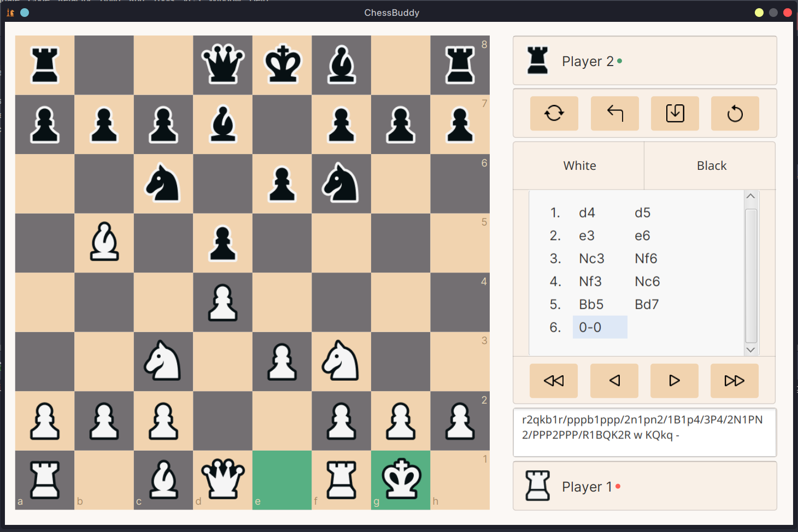
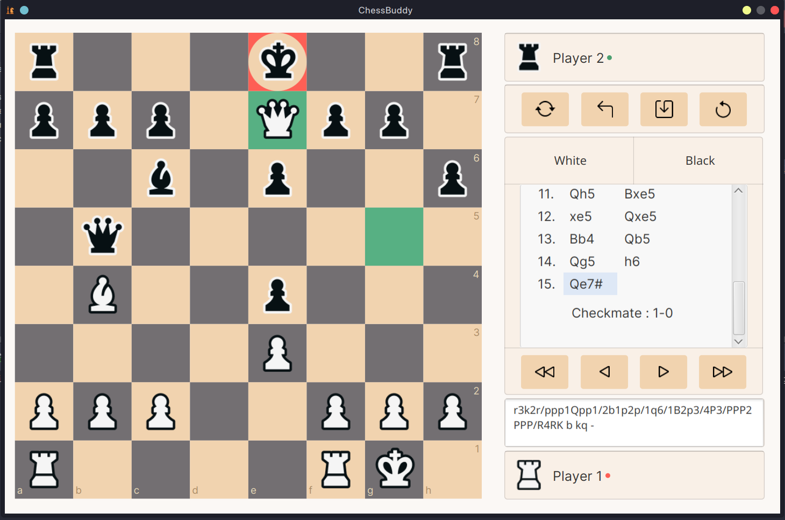

# ChessBuddy 
This is a lightweight Chess GUI for playing Chess on a personal computer. 
ChessBuddy is written in Java and JavaFX. 
It does not depend on any libraries aside from Java and JavaFX API. 

## Features
* Algorithms that follow the rules of Standard Chess
* Supports both Drag-Drop and Click-Click 
* Displays each Game move
* Return to previous board states in the Game
* Flip the board
* Take Back any Move that is made
* Export Game to PGN file
* Display board FEN live (can be copied)

## Upcoming features
* Timing support
* Board and pieces styles customization options
* Inbuilt default Chess Engines
* External Chess Engine load support
* Sound effects customization options
* Full code rebase

### Github Link
https://github.com/internic/javafx-gui.git

## Screenshots

#

